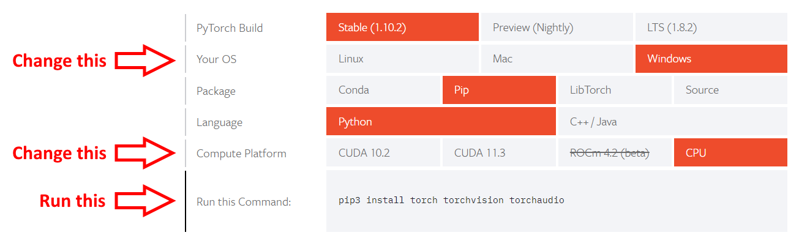
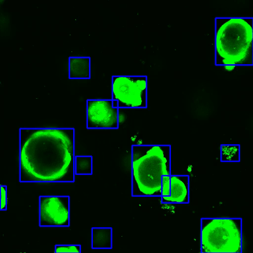
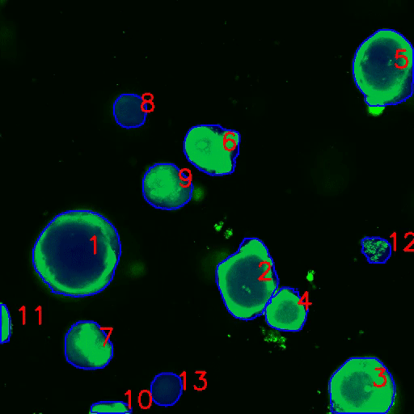

# Epic

[](https://www.python.org/downloads/)
[](https://github.com/AlphonsG/EPIC-BBox-Cell-Tracking/actions/workflows/python-package.yaml)
[](https://coveralls.io/github/AlphonsG/EPIC-BBox-Cell-Tracking?branch=dev)
[](https://github.com/AlphonsG/EPIC-BBox-Cell-Tracking/blob/main/LICENSE)


Harness deep learning and bounding boxes to perform object detection, segmentation, tracking and more.

# Table of contents
1. <a href="#installation">Installation</a>
2. <a href="#usage">Usage</a>
3.  <a href="#examples">Example Output Data</a>
4. <a href="#additional-information">Additional Information</a>
5. <a href="#license">License</a>
6. <a href="#acknowledgements">Acknowledgements</a>
7. <a href="#citation">Citation</a>
8. <a href="#community-guidelines">Community Guidelines</a>
9. <a href="#our-team">Our Team</a>

## Installation <a id="installation"></a>

Epic can be installed on Linux, Windows & macOS and supports Python 3.10 and above. We recommend installing and running Epic within a [virtual environment](https://docs.python.org/3/tutorial/venv.html). Although it is not a requirement, we also recommend installing and running Epic on a GPU-enabled system to minimize processing times.

1. Download and install [Python](https://www.python.org/downloads/) (Epic was tested using [Python version 3.10.6](https://www.python.org/downloads/release/python-3106/)), [Git](https://git-scm.com/) and [Git LFS](https://git-lfs.github.com/).

2. Launch the terminal (*Linux* and *macOS* users) or command prompt (*Windows* users). The proceeding commands will be entered into the opened window<sup>1</sup>.

3. (Optional but recommended) Create and activate a virtual environment called 'epic-env' in your desired directory:

   ```python -m venv epic-env```

   ```. epic-env/bin/activate``` (*Linux* and *macOS* users) or ```epic-env\Scripts\activate.bat``` (*Windows* users)

4. Install PyTorch by specifying your system configuration using the official [PyTorch get started tool](https://pytorch.org/get-started/locally/) and running the generated command:
   <p style="text-align:center;">
    
    </p>
   For example, according to the image above, Windows users without a GPU (i.e. CPU only) will run:

   ```pip3 install torch torchvision torchaudio```


5. Clone this repository into your desired directory:

   ```
   git lfs install
   git clone https://github.com/AlphonsG/EPIC-BBox-Cell-Tracking.git
   ```

6. Navigate into the cloned directory:

    ```cd EPIC-BBox-Cell-Tracking```

7. Install Epic:

   ```
   git submodule update --init --recursive
   pip install -e .
   ```

Notes:
  - <sup>1</sup>Confirm that the correct python version for Epic has been installed using the `python -V` command in the terminal. If this command does not report the correct python version, try using the `python3 -v` command instead. If the second command produces the expected result, replace all `python` and `pip` commands in this guide with `python3` and `pip3`, respectively.

  - The virtual environment can be deactivated using:

      ```deactivate```

## Usage <a id="usage"></a>

Enter `epic -h` or `epic --help` within the `epic-env` environment after installation for details on how to use Epic.

Example commands that can be used to test Epic using input images provided in
each folder [here](misc/examples) are given below. After
processing is finished for a given folder containing input images, multiple subfolders
containing generated outputs (e.g. HTML reports, images, videos, CSV files,
etc) are created. Examples of these are also provided.

Example commands (first run `cd misc` from the cloned repository folder):

- Neutrophil Chemotaxis Assay Analysis

   ```
   epic detection examples/neutrophil_chemotaxis_assay configs/neutrophil_chemotaxis_assay_config.yaml
   ```

- Airway Epithelial Cell Wound Repair Analysis

   ```
   epic tracking examples/airway_epithelial_cell_wound_repair configs/airway_epithelial_cell_wound_repair_config.yaml
   ```

- Gut Organoid Swelling Analysis

   ```
   epic tracking examples/cell_area configs/cell_area_config.yaml
   ```

## Example Output Data <a id="examples"></a>

### Neutrophil Chemotaxis Assay Analysis
<p>
   
   
</p>

Time lapse Image sequence of migrating neutrophils (left) and neutrophils automatically detected in the same image sequence.

### Airway Epithelial Cell Wound Repair Analysis

<p float="left">
   
   
</p>

Automatically detected leading edges (left) and tracked cells (right).

### Gut Organoid Swelling Analysis

<p float="left">
   
   
</p>

Gut organoids automatically detected using bounding boxes (left) and then
segmented from those bounding boxes (right).

## Additional Information <a id="additional-information"></a>

### Configuration files

As seen above, Epic's commands require a configuration file to run. A base configuration file
is provided [here](misc/configs/base_config.yaml). It is optimised for
processing wound repair image sequences containing airway epithelial cells and
can be used to process similar data. To modify configuration parameters, do not
modify the base configuration file, but instead create a new configuration file and only
specify settings from the base configuration file you wish to change there. Examples
of such configuration files for different uses cases are provided
[here](misc/configs).

Notes:
  - The configuration files for the commands above configure Epic to use existing
    object detections located in a subfolder called 'Detections' in each input
    folder. To re-perform object detection (which may take a long time if your
    system does not have a GPU), change the settings `device: cpu` to `device:
    cuda` and `always_detect: no` to `always_detect: yes` in each configuration
    file.

### Object Detection

Epic's default object detector is [Swin
Transformer](https://arxiv.org/abs/2103.14030). It can be
replaced with any other object detector from
[MMDetection](https://github.com/open-mmlab/mmdetection) by specifying the
`checkpoint_file` and `configuration_file` values of the corresponding trained MMDetection model under the `detection` section of an
Epic configuration file. Trained Swin Transformer models that Epic utilises for
different use cases can be found [here](misc/checkpoints).

### Object Tracking

The default appearance and motion features used for object tracking can be replaced with other features by writing a custom feature class that implements the [base_feature](epic/features/base_feature.py) interface (the classes in [appearance_features](epic/features/appearance_features.py) and [motion_features](epic/features/motion_features.py) are examples of that).

The default object tracker can be replaced with any other object tracking
algorithm by writing a custom tracker class that implements the
[base_tracker](epic/tracking/tracker.py) interface
([epic_tracker](epic/tracking/epic_tracker.py) is an example of that).

### Analysis

Epic can automatically create an analysis report as a HTML file after
processing input data. These reports are generated from Jupyter Notebooks.
Under the `analysis` section of an Epic configuration file, `report` needs to
specify the path to a Jupyter Notebook file for automatic HTML report generation.
Examples of report Jupyter Notebooks can be found [here](misc/reports).

### Scripts

The [scripts](misc/scripts) folder contains python scripts to enable additional functionality such as the ability to combine reports from multiple experiments into one file for simpler viewing and comparisons. Run `python <script-name>.py --help` in the terminal to view the usage instructions for a script.

### API Documentation

The documentation for Epic's primary API can be found [here](docs/overview.md).

### Automated Testing

To perform and check the status of the automated tests locally, run the following
commands in the terminal from the root directory of this repository after
cloning:

```
pip install -e .[test]
pytest tests/
```


## License <a id="license"></a>

[MIT License](LICENSE)

## Acknowledgements <a id="acknowledgements"></a>

- https://github.com/bochinski/iou-tracker
- https://github.com/chinue/Fast-SSIM
- https://github.com/SwinTransformer/Swin-Transformer-Object-Detection
- https://github.com/open-mmlab/mmdetection
- https://github.com/etosworld/etos-deepcut

## Citation <a id="citation"></a>

If you use this software in your research, please cite:

```
@Article{jpm12050809,
AUTHOR = {Gwatimba, Alphons and Rosenow, Tim and Stick, Stephen M. and Kicic, Anthony and Iosifidis, Thomas and Karpievitch, Yuliya V.},
TITLE = {AI-Driven Cell Tracking to Enable High-Throughput Drug Screening Targeting Airway Epithelial Repair for Children with Asthma},
JOURNAL = {Journal of Personalized Medicine},
VOLUME = {12},
YEAR = {2022},
NUMBER = {5},
ARTICLE-NUMBER = {809},
URL = {https://www.mdpi.com/2075-4426/12/5/809},
PubMedID = {35629232},
ISSN = {2075-4426},
DOI = {10.3390/jpm12050809}
}
```

## Community guidelines <a id="community-guidelines"></a>

 Guidelines for third-parties wishing to:

- Contribute to the software
- Report issues or problems with the software
- Seek support

can be found [here](https://github.com/AlphonsG/EPIC-BBox-Cell-Tracking/blob/main/CONTRIBUTING.md).

## Our Team <a id="our-team"></a>
[Learn more](https://walyanrespiratory.telethonkids.org.au/our-research/focus-areas/artifical-intelligence/)
