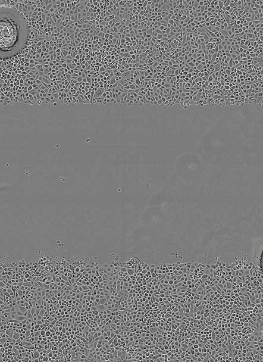
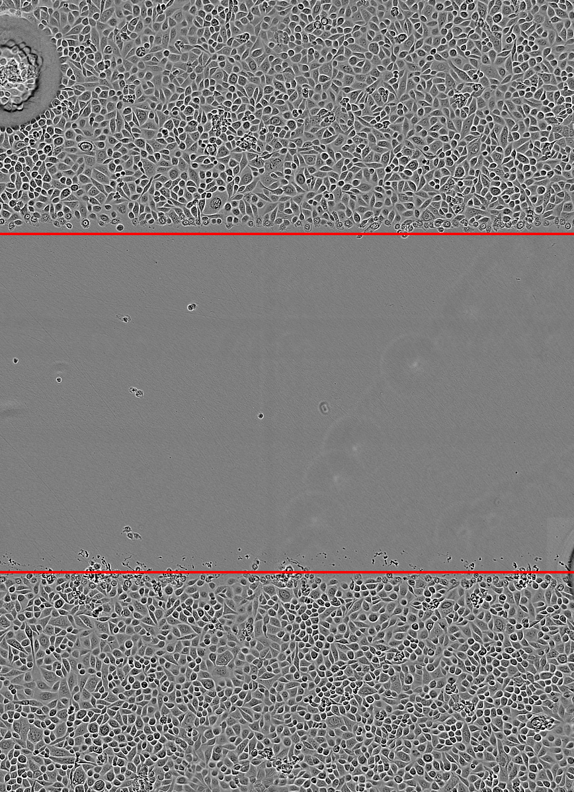

# Epic


Repository for software detailed in 'Fast AI-Enabled Cell Tracking and Migration Analysis for High-Throughput Drug Screening' research paper. See Abstract [below](#research-paper) for more details.

# Table of contents
1. [Installing Epic](#installing-epic)
2. [Using Epic](#using-epic)
3. [Additional Information](#additional-information)
4. [Examples](#examples)
5. [License](#license)
6. [Acknowledgements](#acknowledgements)
7. [Research Paper](#research-paper)
8. [Our Team](#our-team)

## Installing Epic <a name="using-epic"></a>

### Preliminary Information

Epic is written in Python and can be installed on Linux and Windows. Although it is not a requirement, we recommend installing and running Epic on a GPU-enabled system to minimize processing times. To ensure your system is correctly configured for GPU support, please follow the official Tensorflow instructions from [this](https://www.tensorflow.org/install/gpu#hardware_requirements) section onwards.

Epic is designed and tested to be compatible with the following system configurations. While compatibility is not limited to these configurations, it is not guaranteed for other configurations.

| System | Python 3.7 | Python 3.8 |
| :---: | :---: | :--: |
| Ubuntu 20.04 - CPU | ✔️ | ✔️ |
| Windows 10 - CPU | ✔️ | ❌ |
| Ubuntu 20.04 - GPU (CUDA 11.3/cuDNN 8.2) | ❌ | ✔️ |
| Ubuntu 20.04 - GPU (CUDA 10.0/cuDNN 7.4) | ✔️ | ❌ |
| Windows 10 - GPU (CUDA 10.1/cuDNN 7.6) | ✔️ | ❌ |


### Installation
1. [Download](https://docs.conda.io/en/latest/miniconda.html) and install Miniconda3 for your operating system. Detailed and official installation instructions can be found [here](https://conda.io/projects/conda/en/latest/user-guide/install/index.html), if needed.
Windows users must additionally download and install [Build Tools for Visual Studio 2019](https://visualstudio.microsoft.com/downloads/#build-tools-for-visual-studio-2019).

2. Launch the terminal (*Linux users*) or run 'Anaconda Prompt (miniconda3)' (*Windows users*). The proceeding commands will be entered into this window.

3. Create a virtual environment called 'epic_env':

   ```conda create -n epic_env python={PYTHON_VERSION} cmake git git-lfs```

    Replace `{PYTHON_VERSION}` with the compatible python version number for your system, using the table above as a guide. For example, Ubuntu 20.04 users with an RTX 3090 GPU (CUDA 11.1+, cuDNN 8.0+) will run:

   ```conda create -n epic_env python=3.8 cmake git git-lfs```

4. Activate the environment:

   ```conda activate epic_env```


5. Clone this repository into a desired directory and navigate into the cloned folder:

   ```git clone  --recurse-submodules https://github.com/AlphonsGwatimba/Fast-AI-Enabled-Cell-Tracking-and-Migration-Analysis-for-High-Throughput-Drug-Screening.git```

    ```cd Fast-AI-Enabled-Cell-Tracking-and-Migration-Analysis-for-High-Throughput-Drug-Screening```

6. Install Epic:

   ```pip install -e . --use-deprecated=legacy-resolver```

- Note:  Virtual environment can be deactivated using:

   ```conda deactivate epic_env```

## Using Epic <a name="using-epic"></a>

Epic is a command line application. Enter `epic --help` within the `epic_env` environment for details on how to use Epic. Some of Epic's commands require a configuration file to run. A base configuration file that can be used and modified is provided [here](misc/configs/config.yaml).

A wound repair time-lapse image sequence is provided [here](misc/examples/image_sequence_1) as example input data that can be used to test Epic.

## Additional Information <a name="additional-information"></a>

### Object Detection

Epic's default object detector is a [Luminioth](https://github.com/tryolabs/luminoth) implementation of [Faster R-CNN](https://arxiv.org/abs/1506.01497). The models provided [here](epic/detection/models/luminoth/checkpoints) have been trained for airway epithielal cell detection. To retrain the current detector, for example to detect other object classes, please follow Luminoth's [guide](https://luminoth.readthedocs.io/en/latest/usage/training.html) and specify the generated model checkpoint IDs in the configuration file.

Additionally, the current detector can be easily replaced with any other object detector or segmenter by writing a custom detector class that implements the [base_detector](epic/detection/base_detector.py) interface ([luminoth_detector](epic/detection/luminoth_detector.py) is an example of that).

### Object Tracking

The current appearance and motion features used for object tracking can be easily replaced with other features by writing a custom feature class that implements the [base_feature](epic/features/base_feature.py) interface (the classes in [appearance_features](epic/features/appearance_features.py) and [motion_features](epic/features/motion_features.py) are an example of that).

The current object tracker can also be easily replaced with any other object tracking algorithm by writing a custom tracker class that implements the [base_tracker](epic/detection/base_detector.py) interface ([epic_tracker](epic/detection/luminoth_detector.py) is an example of that).
### Analysis

Epic can automatically generate an analysis report after performing object tracking in an image sequence. A base report file for cell migration analysis that can be modified is provided [here](misc/notebooks/report.ipynb) as a Jupyter notebook. The path of a Jupyter notebook needs to specified in the configuration file for automatic report generation.


## Examples <a name="examples"></a>

Example outputs generated after processing a wound repair time-lapse image sequence using Epic are shown below.

### Raw Image Sequences (Left) and Automatically Detected Leading Edges (Right)
<p float="left">
   
   
</p>

### Cell Detections (Left) and Cell Tracks (Right)
<p float="left">
   
   
</p>

## License <a name="license"></a>

[MIT License](LICENSE)

## Acknowledgements <a name="acknowledgements"></a>

- https://github.com/bochinski/iou-tracker
- https://github.com/chinue/Fast-SSIM
- https://github.com/tryolabs/luminoth

## Research Paper <a name="research-paper"></a>

### Title
Fast AI-Enabled Cell Tracking and Migration Analysis for High-Throughput Drug Screening

### Abstract
To be released

### Access
To be released

## Our Team <a name="our-team"></a>
[Learn more](https://walyanrespiratory.telethonkids.org.au/our-research/focus-areas/artifical-intelligence/)
